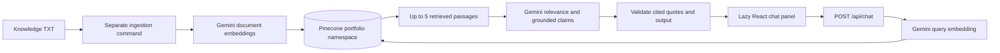

# Hassam AI — setup, architecture, and verification

## Status

Integrated into the existing React 19.3 / TypeScript / Vite 7.3 / Tailwind 4.3 portfolio. The launcher appears across routes; the panel is loaded only on first use. Portfolio content, case studies, links, and motion remain in place.

Credentials are configured locally in Git-ignored .env.local. On September 18, 2026, live ingestion succeeded and Pinecone confirmed 21 source records. The final 31-case evaluation completed with zero unexpected fallback failures; answers and the three-turn follow-up were reviewed against the supplied knowledge. A real browser request returned HTTP 200 with all three FastAPI projects. Intermittent provider connection timeouts were observed during testing. Vercel deployment and production firewall configuration remain unverified.

## Setup

Use Node 24 and the committed npm lockfile. Windows PowerShell examples use npm.cmd.

1. Copy `.env.example` to `.env.local`. Set `GEMINI_API_KEY`, `PINECONE_API_KEY`, and `PINECONE_INDEX_NAME`. Never prefix secrets with `VITE_`. Both environment files are ignored by Git.
2. In Pinecone, create a **serverless dense index with 768 dimensions and cosine similarity**, with the name in your environment. Choose your account's supported cloud/region. Do not select integrated embeddings: this application supplies Gemini vectors. The index is created once, outside runtime requests.
3. Keep `PINECONE_NAMESPACE=portfolio` dedicated to this source. The code checks index readiness, dimensions, and metric.
4. Run:

```powershell
npm.cmd ci
npm.cmd run check:ai
npm.cmd run ingest:check
npm.cmd run ingest
npm.cmd run dev
```

Open the printed Vite URL (normally http://127.0.0.1:5173). The command starts Vite and the local API at 127.0.0.1:3001 in one process. The Vite proxy keeps browser requests same-origin. Port 3001 must be free. `dev:ui` and `preview` serve the frontend only; they do not provide a live chat API.

## Models and dependencies

Only two runtime packages were added; no chat, animation, Markdown, or agent framework:

| Package | Installed version | Use |
| --- | --- | --- |
| `@google/genai` | 2.23.0 | Official Google SDK, query/document embeddings and grounded generation |
| `@pinecone-database/pinecone` | 9.0.0 | Official Pinecone SDK, index verification, query, list, upsert and stale-vector deletion |

Defaults verified against current official documentation on September 17, 2026:

- Embeddings: `gemini-embedding-2`, **768 dimensions**. Google documents [Embedding 2 and its task prefixes](https://ai.google.dev/gemini-api/docs/embeddings). Documents use `title: … | text: …`; questions use `task: question answering | query: …`. Embedding 2 does not accept the older taskType field. Each embedding title includes the portfolio owner, section, and chunk title. This prevents questions mentioning Hassam from favoring biography passages over skills. Each document is embedded separately because an array of inputs would be aggregated by this model.
- Generation: [`gemini-3.5-flash-lite`](https://ai.google.dev/gemini-api/docs/models/gemini-3.5-flash-lite), selected for short portfolio answers.
- Every returned embedding is dimension-checked and normalized. Query and document settings are shared.
- The explicit compatibility adapter also supports `gemini-embedding-001` with RETRIEVAL_DOCUMENT / RETRIEVAL_QUERY, if needed for account access. Changing model requires re-ingestion even when dimensions match. Changing dimensions requires a matching new index and full re-ingestion.
- [Pinecone SDK 9 documentation](https://sdk.pinecone.io/typescript/) matches the installed SDK's object-form index/upsert/delete APIs.

Both default models responded successfully with the configured account. The supplied Pinecone index is ready with 768 dimensions and cosine similarity. Successful index-management access does not establish connectivity to its separate vector endpoint.

## Architecture



The API never reads or embeds the full knowledge document. Google/Pinecone clients are reused per process; successful index checks are cached. No tools, external actions, browsing, or arbitrary file access are available to the assistant.

Files:

- `src/components/chatbot/ChatLauncher.tsx`: small persistent launcher, lazy import, load-error boundary.
- `ChatPanel.tsx`, `chatbot.css`: native modal dialog, focus restoration, Escape, starters, transcript, retry/reset, abort handling, responsive layouts and reduced motion.
- `api/chat.ts`: Vercel/Node HTTP adapter, validation, same-origin check, rate/concurrency guards, deadlines, sanitized statuses.
- `server/contracts.ts`, `config.ts`: bounded request contract, server-only configuration and shared source ID.
- `server/providers.ts`: official clients, model adapter, vector/index checks and metadata-filtered retrieval.
- `server/rag.ts`: trusted policy, follow-up query context, relevance/answerability instruction, evidence validation and development tracing.
- `server/chunking.ts`: section parser and stable chunk IDs.
- `server/rate-limit.ts`: bounded, expiring, hashed-IP per-instance limiter.
- `scripts/ingest.ts`, `env.ts`, `dev.ts`, `evaluate-rag.ts`: ingestion, environment loading, local server and live evaluation.
- `knowledge/hassam_ali_portfolio_rag_knowledge_base.txt`: the supplied authoritative document, preserved unchanged.
- `tests/rag.test.ts`, `chat-api.test.ts`, `chatbot.spec.ts`: offline boundary and browser checks.

Existing modified files: App, Vite configuration, TypeScript configuration, package manifest/lockfile, Vercel routes, and README. Existing pages remain the source for the visible portfolio; the supplied TXT independently supplies chatbot facts.

## Chunking and updates

The current source produces **21 chunks**, including **nine separate project chunks**. Projects retain descriptions and technology lists together. Education includes UAF and SMIT. Technical skills are separated at named topics; other professional sections remain whole.

Each vector stores `source`, `type`, `title`, `section`, `technologies`, `text`, `embeddingModel`, and `embeddingDimension`. IDs hash section + title under a dedicated source prefix. The document's response-policy section is excluded: instructions in source documents never replace the trusted server policy.

To update:
1. Edit the TXT, preserving its uppercase section headings and numbered project structure.
2. Run `npm.cmd run ingest:check`, then `npm.cmd run ingest`.
3. Wait briefly for Pinecone's eventual consistency, then run `npm.cmd run eval:rag`.
4. Deploy only if code/configuration changed; vector-only updates are available without rebuilding the frontend.

Project paragraphs currently start their description with A, An, or Hassam after a short title. Duplicate titles and sections above 8,000 characters fail validation instead of silently overwriting or truncating facts. Split unusually large sections into meaningful supported subsections and update the parser/tests when changing the source format.

All embeddings complete before writes begin. Existing IDs are overwritten; stale IDs under this source prefix are deleted only after successful upserts. Foreign prefixes are never deleted. Do not run concurrent ingestions into the same namespace. This is an idempotent update, not a transactional index swap: an interrupted write can leave a mixed version until ingestion is rerun.

## Retrieval, grounding, and memory

Default topK is **5**, configurable from 3 to 5. Retrieval filters to this source AND the configured embedding model/dimension. Explicit project questions additionally filter to project chunks; skills, algorithm, and database questions filter to skills/project chunks. This scope is derived from the current question, not conversation history. A short current question is embedded; referential follow-ups also include at most four recent messages, capped at 800 characters each.

No universal cosine cutoff is assumed. `RAG_MIN_SCORE` is optional and intentionally unset until live evaluation establishes score distributions. With no hits, generation is skipped. With candidates, Gemini judges whether those passages directly answer the question and returns only supported claims. If an asserted answer fails evidence validation, at most one extra generation attempt requests exact quotations; genuine unsupported-information refusals are never retried. An irrelevant match must result in `answerable=false`; this is a semantic relevance gate, not an assertion that every nearest neighbor is relevant.

The server checks each claim's citation ID, exact supporting quotation, output limits, and numerical evidence. Malformed or unsupported output falls back to:

> I don't have that information in Hassam's portfolio knowledge base.

The policy treats history, questions, and retrieved text as untrusted data; forbids invented employment, metrics, contact details, or qualifications; and keeps answers in third person. Common extraction and fabrication attacks are rejected before provider calls. Mixed questions may answer supported parts and include the fallback for missing information.

Exact-quote checks do not formally prove that every paraphrase is entailed. Regex guards do not cover all prompt injection. Real-model adversarial and factual evaluation remains necessary; the system never presents these measures as a guarantee.

The browser keeps at most 40 messages in memory and sends only the last 8. Nothing is written to localStorage or a visitor database. Closing the panel retains the current session; refresh clears it. Clearing aborts in-flight work and prevents late replies. Google and Pinecone receive the inputs necessary for their API operations; their account-level data policies apply.

## Endpoint and operational protections

`POST /api/chat`, Content-Type application/json:

```json
{"message":"Which projects use FastAPI?","history":[]}
```

Success: `{"success":true,"answer":"…"}`. Failures contain only `success:false` and a safe `error`.

- 1–1,200 character questions, at most 8 user/assistant turns of 2,400 characters, 24 KB request body.
- 400 invalid body/history, 403 cross-site origin, 405 method, 413 size, 415 content type, 429 rate limit, 503 provider/configuration failure, 504 timeout.
- 40-second request deadline, 25-second Gemini transport timeout, 12-second Pinecone transport timeout, and 45-second browser timeout.
- Per-instance: 10 requests/minute/IP and at most 8 active requests; hashed ephemeral IP keys, bounded to 5,000 entries. Vercel's platform IP header is used only when running on Vercel.
- No CORS wildcard, no response cache, no raw HTML rendering, no stack traces/provider exceptions or retrieval metadata in browser responses.
- Browser requests and errors can be retried; duplicate submission is blocked.

**The in-memory limiter is not global across Vercel instances or cold starts.** Before public launch, use the [Vercel Firewall rate-limit template](https://vercel.com/kb/guide/add-rate-limiting-vercel) for path `/api/chat`, method POST, per client IP, initially 10 requests per minute. Also configure provider quotas/budgets appropriate to your account. If your plan does not provide the needed edge controls, a distributed Redis limiter is the alternative; it was not added as an unnecessary dependency here. No firewall rule has been deployed from this workspace.

## Connectivity checks

Run `npm.cmd run check:ai` after configuring the environment or changing networks. It checks index settings, vector-service access, and small live Gemini embedding/generation requests. These calls may be billable. Failures produce fixed diagnostic hints, never raw provider messages, keys, request URLs, or stack traces. A connection timeout means no authenticated response was received from that endpoint; it does not indicate a bad key. Earlier persistent vector-service timeouts were resolved before the September 18 ingestion.

## Debugging and live evaluation

Set `RAG_DEBUG=true` in .env.local and restart `npm.cmd run dev`. The server terminal shows the query, retrieved count/titles/sections/scores, fallback and timings. This is opt-in and hard-disabled when NODE_ENV=production. Do not use real secrets as test questions. No debug data is added to client responses, and provider exceptions are never printed.

After configuring keys and ingesting:

```powershell
npm.cmd run eval:rag
```

This makes billable real API calls and prints question, answer, retrieved titles/scores, fallback checks and latency. It covers 13 supported questions, 8 unsupported questions, 7 injection attempts, and a 3-turn database/project follow-up. It records the same retrieval used to generate each answer, avoiding duplicate embedding/query calls. Requests are paced by six seconds. A rate limit gets one retry after 45 seconds; a transient connection failure gets one retry after five seconds. Reported evaluation durations include these waits. The test exits nonzero for unexpected fallback behavior. Read all answers yourself: fallback counts alone do not validate factual accuracy or reference resolution.

Compare topK 3 and 5 and inspect irrelevant/unsupported matches. Only set RAG_MIN_SCORE if observed score separation supports a useful cutoff; rerun the full suite after any retrieval/model change. Pay particular attention to FastAPI returning Flight Management, Sales & Inventory, and Automated EDA, and to employment questions refusing to infer jobs from projects.

## Vercel deployment

Deploy the **repository**, not only dist. Keep the Vite preset, Node 24, build `npm run build`, output `dist`. [Vercel supports Node 24 functions](https://vercel.com/changelog/node-js-24-lts-is-now-generally-available-for-builds-and-functions).

Set GEMINI_API_KEY, PINECONE_API_KEY, PINECONE_INDEX_NAME and any overrides in Vercel project Environment Variables for the desired Production/Preview environments. Redeploy after changing them. Use a separate index or namespace for experimental preview ingestion.

`api/chat.ts` becomes the server-side function. `vercel.json` reserves /api and real assets before the SPA fallback and sets a 60-second platform duration. Do not run ingestion during the build or per visitor request.

Verify POST /api/chat, case-study direct URLs/refreshes, portrait assets, the chat on a real phone, and missing-key/error behavior after deployment. Static Netlify or GitHub Pages hosting alone will serve the portfolio but cannot run this endpoint; port the function or provide a same-origin backend before enabling live chat there.

## Local verification

```powershell
npm.cmd run ingest:check
npm.cmd test
npm.cmd run lint
npm.cmd run build
$env:PLAYWRIGHT_CHANNEL = 'msedge'
npm.cmd run test:browser
```

The browser suite uses controlled HTTP responses and tests mobile widths, keyboard focus, Escape, starters, bounded history, multiline input, loading/duplicate prevention, network failure/retry, clear/cancel, safe text rendering, and reduced motion. It also runs the existing portfolio regression checks. See the completion report for the exact executed results. Real Safari/Firefox, physical mobile keyboards, manual screen-reader review, and Vercel hosting remain separate checks. Live-provider results are recorded below.

## Historical checks - September 17, 2026

- Production build and TypeScript check: passed.
- ESLint: passed.
- Unit/API suite: 18 passed.
- Playwright with installed Edge: 34 passed across desktop and mobile, including all 22 prior portfolio checks.
- Ingestion dry run: 21 chunks, nine projects; no external writes.
- Local dev proxy/API smoke check: GET 405, missing-credential POST 503 with sanitized text, prompt-extraction request 200 with fallback.
- Desktop 1440px and mobile 390px screenshots reviewed; no runtime page errors observed. Browser tests also covered 320px, 768px, and 1440px chat widths.
- Build inspection found no Gemini/Pinecone SDK or secret-variable names in browser assets. Lazy chat panel is 5.52 KB / 2.30 KB gzip.
- npm audit during dependency installation: zero reported vulnerabilities.
- Live ingestion/upsert, provider model access, answer/score calibration, live follow-up accuracy, deployed firewall and Vercel deployment: not executed because the owner chose to configure credentials later.

## Credential setup follow-up

The supplied server credentials were saved only in Git-ignored .env.local. Default Gemini embedding/generation calls succeeded; Pinecone index management verified the requested index settings. Initial vector-service HTTPS checks timed out at all three resolved addresses, so ingestion stopped while listing vectors and made no vector writes. After the owner reported the network switch complete, a retry still timed out. Independent unauthenticated checks also timed out in Windows HTTP and curl (curl exit 28, no HTTP response), confirming that the failure is not limited to the Pinecone SDK. Keys shared in chat should be rotated in their provider dashboards and replaced locally. Added check:ai and safe provider failure hints; the expanded offline suite has 20 passing tests.

### Vector endpoint connectivity follow-up

Check the exact Host URL from the Pinecone console in a browser. Any HTTP response, including Unauthorized or Not Found, establishes network reachability; a timeout does not. If the browser also times out, check outbound HTTPS access to that host with the network/security provider, or run ingestion from another machine with working service access. Do not disable certificate verification, weaken the index settings, or recreate the index to address a transport timeout. Once reachable, run `npm.cmd run check:ai`, `npm.cmd run ingest`, and `npm.cmd run eval:rag`. No vectors were written during these failed attempts.

## Live validation - September 18, 2026

- All four service checks passed: Gemini embeddings, Gemini generation, Pinecone index settings, and Pinecone vector access.
- Ingested and then updated all 21 chunks. Stats and a source-prefix listing both returned exactly 21 records, with 768 dimensions.
- Fixed live retrieval misses by embedding owner/section context and applying question-specific metadata scope.
- Kept topK=5. A universal similarity cutoff was not justified: the unsupported Google-employment question scored about 0.74, above the supported Flight Management question at about 0.69. Semantic answerability and exact evidence validation remain the fallback gate.
- Added one bounded evidence-format repair; incorrect quotations still fail closed, and explicit unsupported refusals are not retried.
- Final live evaluation: 13 supported questions answered, 8 unsupported questions refused, 7 injection attempts refused, and all 3 follow-up turns answered with the correct project reference. Automated unexpected fallback count: 0. Answers were also manually reviewed against the supplied facts.
- Fixed a real local-browser HTTP 403: Vite's string proxy shorthand enabled changeOrigin. The explicit proxy now preserves Host, while the API still rejects foreign origins.
- Real browser request through Vite and /api/chat returned HTTP 200 and named Sales & Inventory Analytics API, Flight Management System, and Automated EDA System for FastAPI. Desktop and mobile screenshots reviewed.
- Latest offline checks: 23 unit/API/proxy tests passed, lint passed, TypeScript and production build passed. The earlier 34 desktop/mobile regression checks remain recorded above; this follow-up additionally tested the live browser path.
- Local detailed evaluation output: test-results/rag-live-eval-final.txt (Git-ignored). Live screenshots: test-results/chat-live-desktop.png and chat-live-mobile.png.
- Remaining operational limitations: intermittent provider/network timeouts occurred, and hosted Vercel deployment/global firewall rate limiting have not been performed. The browser exposes safe errors and Retry; the evaluation makes one bounded retry for transient failures.
